# RBP-Binding: RNA-Binding Prediction, Splice-Aware Modeling, and Variant-Effect Analysis

<p align="center">
  <strong>I built a reproducible computational-biology pipeline that learns protein–RNA binding from sequence, stress-tests biological confounders, and transfers the learned signal to ClinVar variant analysis.</strong>
</p>

<p align="center">
  
  
  
  
  
  
</p>

---

## Abstract

I built **RBP-Binding** to answer two connected research questions:

1. **Binding prediction:** Given a 101-nucleotide RNA sequence, can I predict whether a specific RNA-binding protein binds near its center?
2. **Variant effect:** If I replace one nucleotide with a ClinVar alternate allele, does the predicted binding probability change enough to distinguish pathogenic from benign variants?

I trained separate models for **16 RNA-binding proteins** using reproducible ENCODE eCLIP peaks, GENCODE GRCh38 sequence and annotation, and carefully matched negative windows. I compared a lightweight DeepBind-style CNN with three pretrained RNA language-model strategies: RNA-FM with LoRA, fully fine-tuned RNABERT, and fully fine-tuned SpliceBERT.

The strongest model was **SpliceBERT**, which achieved a mean held-out test AUROC of **0.893** and won **13 of 16** protein-level comparisons. I then designed a splice-distance-matched ablation to test whether its advantage came from exploiting splice-site proximity. The observed AUROC changes were small, supporting the conclusion that the model learned genuine RBP-binding signal rather than a simple splice-site shortcut.

Finally, without training on disease labels, I used the tuned models to score **6,055 ClinVar pathogenic/benign SNVs located at real binding sites**. SpliceBERT reached an AUROC of **0.837 for noncoding variants**, while performance was much weaker for coding variants—an important domain-specific result consistent with what an RNA-binding model should and should not be expected to capture.

---

## Project at a Glance

| Dimension | What I implemented |
|---|---|
| Biological targets | 16 RNA-binding proteins |
| Primary data | ENCODE reproducible eCLIP peaks |
| Reference sequence | GENCODE v45 GRCh38 primary assembly |
| Gene annotation | GENCODE v45 GTF |
| Downstream variants | ClinVar GRCh38 Pathogenic/Benign SNVs |
| Model input | 101-nt strand-corrected RNA windows |
| Main negative design | Transcript-, region-, GC-, and distance-matched negatives |
| Evaluation split | Whole-chromosome train/validation/test partition |
| Model families | CNN, RNA-FM + LoRA, RNABERT, SpliceBERT |
| Primary training runs | 16 proteins × 4 model families |
| Ablation runs | 4 proteins with splice-distance-matched negatives |
| Produced checkpoints | 20 CNN + 60 language-model checkpoints |
| Best binding model | SpliceBERT, mean test AUROC 0.893 |
| ClinVar result | SpliceBERT AUROC 0.837 on noncoding variants at binding sites |
| HPC platform | Northeastern Explorer with Slurm |
| Actual GPU hardware | NVIDIA Tesla V100-SXM2-32GB |

---

## Documentation

Two in-depth companion documents accompany this README:

- **[docs/RBP_BINDING_MASTERCLASS.md](docs/RBP_BINDING_MASTERCLASS.md)** — the full *science* walkthrough: biology, data, preprocessing, models, results, and the decision log, from first principles.
- **[docs/CLUSTER_AND_OPS_MASTERCLASS.md](docs/CLUSTER_AND_OPS_MASTERCLASS.md)** — the full *operations* walkthrough: the cluster, Slurm, how to read every command's output, the data/process flow, the validation gate, `rsync`, and every error encountered with its fix.

---

## Why I Built This

RNA-binding proteins regulate splicing, transcript stability, localization, translation, and degradation. A variant does not need to change an amino acid to have a biological effect: it may instead destroy or create an RBP-binding site and alter post-transcriptional regulation.

I therefore built this project as a complete research workflow rather than a single modeling notebook. I wanted to demonstrate that I could:

- translate a biological question into a precise prediction task;
- integrate large public genomics datasets safely;
- prevent sequence leakage and shortcut learning;
- compare small task-specific models with large pretrained models fairly;
- discover and test a plausible biological confound;
- operationalize dozens of experiments on an HPC cluster;
- and report both positive and negative findings honestly.

---

## Research Questions

### Primary question

> Given a 101-nucleotide RNA sequence, how accurately can I predict whether a selected RBP binds near the center of that sequence?

### Model-comparison question

> Does a large general RNA foundation model outperform a small sequence CNN, or does a biologically specialized pretrained model provide a better accuracy–compute trade-off?

### Confound question

> Are the models learning protein-specific binding preferences, or are they obtaining inflated scores by detecting proximity to splice sites?

### Downstream question

> Can a binding model that has never seen disease labels assign larger disruption scores to pathogenic noncoding variants than to benign variants?

---

# 1. Biological Foundation

## 1.1 My Biological Mental Model

I treat an RNA molecule as a sequence made from four nucleotides—A, C, G, and U—and an RNA-binding protein as a molecular reader that prefers particular sequence and context patterns.

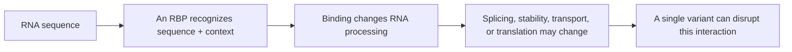

In this project, I model binding from sequence alone. I do not use expression, conservation, experimentally measured structure, or tissue-specific covariates as model inputs. This makes the scope narrower, but it also makes the experiment interpretable and allows me to score hypothetical reference and alternate sequences consistently.

## 1.2 How eCLIP Provides My Positive Labels

I use **enhanced crosslinking and immunoprecipitation (eCLIP)** data from ENCODE. eCLIP captures RNA fragments that were physically bound by a selected protein in living cells.

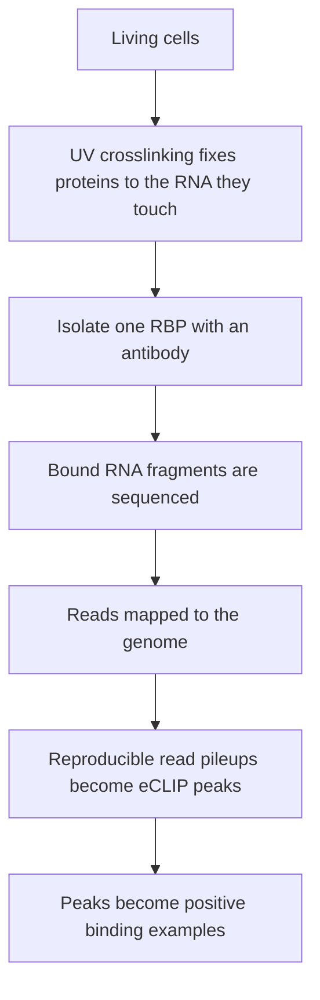

I use **reproducible peaks**, not single-replicate peak calls. These intervals represent sites supported across biological replicates and therefore provide a more defensible label source.

## 1.3 Protein Panel

I use `config/proteins.tsv` as the single source of truth for the complete experiment.

| Protein | ENCODE accession | Cell line |
|---|---|---|
| TARDBP | ENCFF593RED | K562 |
| FUS | ENCFF861KMV | K562 |
| RBFOX2 | ENCFF206RIM | K562 |
| PUM2 | ENCFF880MWQ | K562 |
| IGF2BP1 | ENCFF650LMV | K562 |
| MATR3 | ENCFF246EPM | K562 |
| TIA1 | ENCFF918KMT | K562 |
| EWSR1 | ENCFF607ZRF | K562 |
| IGF2BP2 | ENCFF524ZZB | K562 |
| IGF2BP3 | ENCFF886SDQ | HepG2 |
| ELAVL1 | ENCFF566LNK | K562 |
| LIN28B | ENCFF061XNA | K562 |
| PTBP1 | ENCFF907HNN | K562 |
| QKI | ENCFF786UOW | K562 |
| U2AF1 | ENCFF640IHY | K562 |
| PUM1 | ENCFF094MQV | K562 |

I excluded candidate proteins whose reproducible peak sets were too small to maintain reliable validation and test subsets. I preferred 16 adequately supported targets over a larger panel containing unstable metrics.

---

# 2. Data Sources

| Source | What I use it for | Primary files |
|---|---|---|
| ENCODE | Experimentally observed RBP-binding peaks | Per-protein reproducible narrowPeak/BED files |
| GENCODE v45 | Human reference sequence | `GRCh38.primary_assembly.genome.fa` |
| GENCODE v45 | Transcript, exon, CDS, and UTR annotation | `gencode.v45.primary_assembly.annotation.gtf.gz` |
| ClinVar | Pathogenic and benign human variants | GRCh38 `clinvar.vcf.gz` |

## 2.1 How the Sources Connect

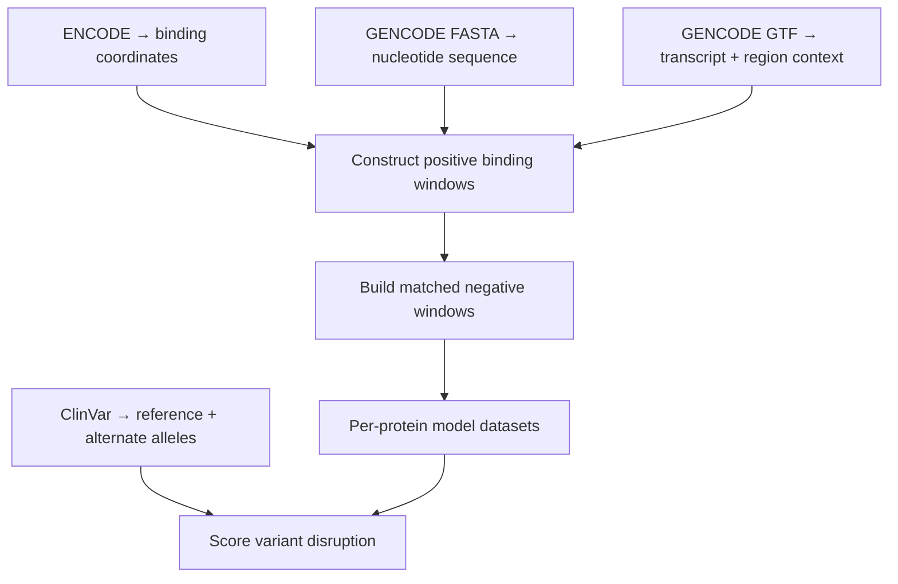

## 2.2 Coordinate and Strand Rules

I explicitly handle several common genomics failure points:

- BED/narrowPeak coordinates are **0-based and half-open**.
- GTF and VCF coordinates are **1-based** and require explicit conversion.
- ENCODE/GENCODE chromosome names use values such as `chr1`, while ClinVar may use `1`.
- The reference FASTA always returns the positive genomic strand.
- For negative-strand peaks, I reverse-complement the extracted sequence.
- I store a DNA form and an RNA form, converting `T` to `U` for RNA language models.

These checks are necessary because a pipeline can run successfully while silently extracting the wrong nucleotide or orientation.

---

# 3. End-to-End Research Pipeline

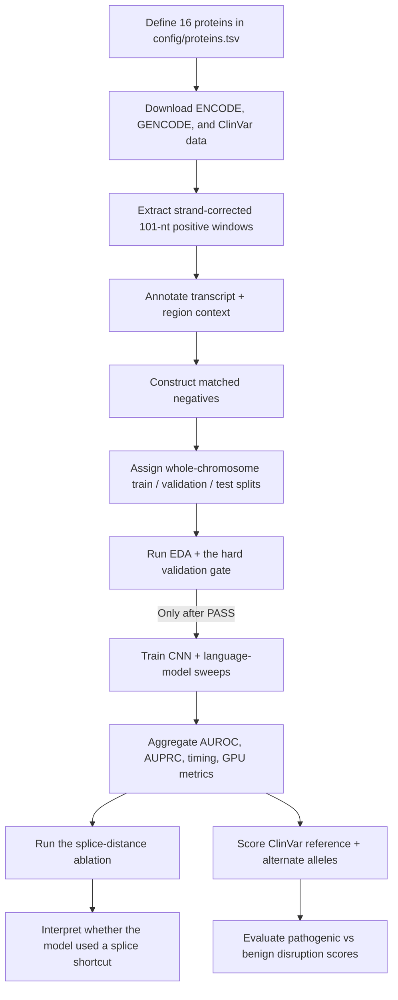

The most important design principle is that I do **not** treat data preparation as a prelude to the “real” work. Dataset design, leakage control, validation, and confound testing are central research contributions in this repository.

---

# 4. Dataset Construction

## 4.1 Positive Windows

For every eCLIP peak, I:

1. calculate the peak midpoint;
2. extract `[mid - 50, mid + 51)` from GRCh38;
3. verify the result is exactly 101 nucleotides;
4. reject windows containing `N`;
5. reverse-complement negative-strand windows;
6. annotate the overlapping transcript and biological region;
7. save both DNA and RNA sequence forms.

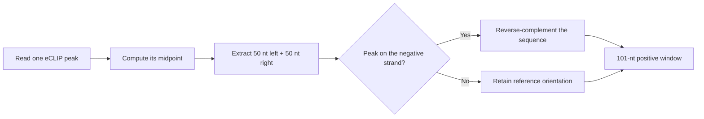

## 4.2 Matched Negatives

My primary negative sampler is deliberately strict. For every positive, I attempt to choose one negative that is:

- from the same transcript first, with fallback to another transcript bound by the same protein;
- from the same biological region type;
- within ±5 percentage points of the positive’s GC fraction;
- at least 500 nt from every called peak for that protein;
- exactly 101 nt long;
- free from unknown bases.

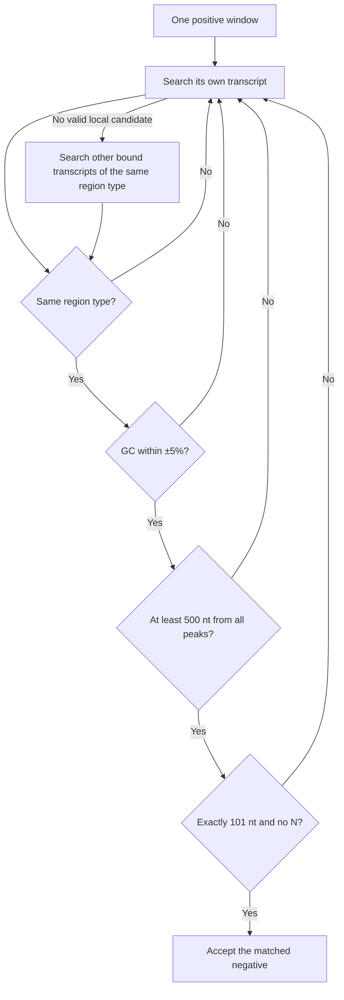

This design prevents a model from winning merely by distinguishing transcribed sequence from random genomic background, or by exploiting large GC and region-composition differences.

If no candidate satisfies the ±5% GC band, I relax the band as a last resort (±10%, then unconstrained) and record how often this happens; in practice relaxation was rare.

## 4.3 Splice-Distance-Matched Ablation

EDA revealed enrichment of the canonical splice-donor-like sequence `GGUAAG` for PUM1, LIN28B, and U2AF1. I therefore built a secondary negative set for:

- PUM1
- LIN28B
- U2AF1
- RBFOX2 as a clean-motif control

In these datasets, I preserve all primary matching requirements and additionally require the negative to fall into the same nearest-splice-site distance bucket as its positive.


I use this as an **ablation**, not as a silent replacement for the primary dataset. The purpose is to measure how much model performance depends on splice proximity.

## 4.4 Chromosome-Based Split

I avoid random row-level splitting because neighboring windows and repeated genomic sequences can leak across splits.

| Split | Chromosomes |
|---|---|
| Test | `chr1`, `chr2`, `chr20` |
| Validation | `chr19`, `chr16`, `chr13`, `chr18` |
| Train | All remaining standard chromosomes |

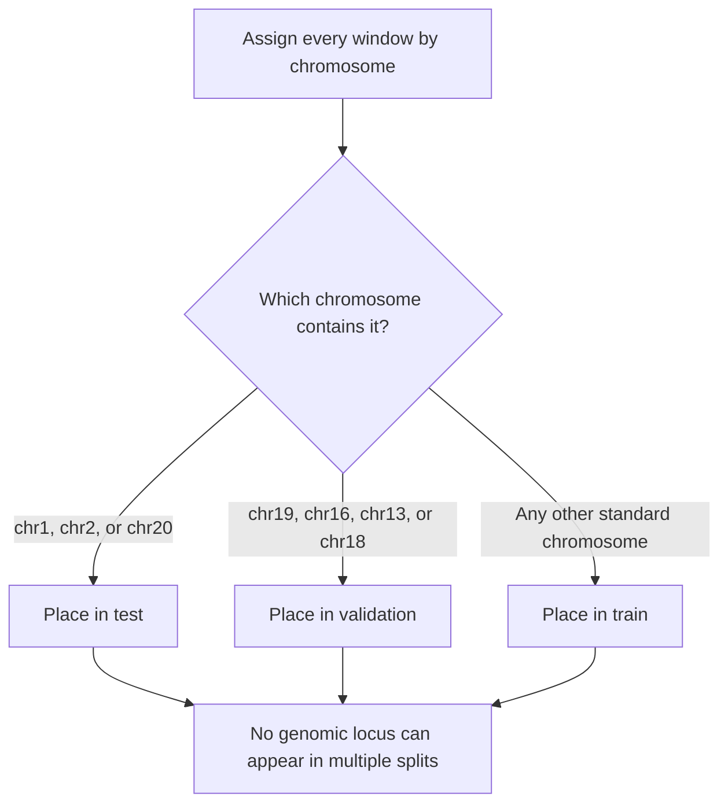

Observed dataset proportions were approximately **64.6% train, 15.5% validation, and 19.9% test**. Every protein retained at least 100 positive–negative pairs in validation and test.

I chose this specific multi-chromosome split for two reasons beyond leakage safety: spreading the test set across three chromosomes gives a more robust generalization estimate than a single test chromosome, and it matches a collaborator's split so the numbers are directly comparable.

---

# 5. Exploratory Data Analysis and Validation

## 5.1 What I Verified Before Training

My EDA is a stress test of modeling assumptions rather than a purely visual exercise. I check:

- class balance;
- split size and chromosome distribution;
- positive/negative GC differences;
- nucleotide composition;
- region composition;
- peak-width distributions;
- enriched k-mers and positional motif patterns;
- low-complexity sequence prevalence;
- duplicate windows and cross-split sequence leakage.

Key observed checks:

- maximum mean positive/negative GC gap was at most **0.010**;
- no duplicate windows crossed train/validation/test boundaries;
- expected motifs were recovered for proteins including RBFOX2, QKI, PTBP1, and TARDBP;
- the splice-donor enrichment discovered in EDA motivated the explicit ablation.

## 5.2 My Hard Validation Gate

I designed the cluster pipeline so model training cannot begin automatically after preprocessing. Phase A stops after validation, and I manually inspect the validation log before launching Phase B.

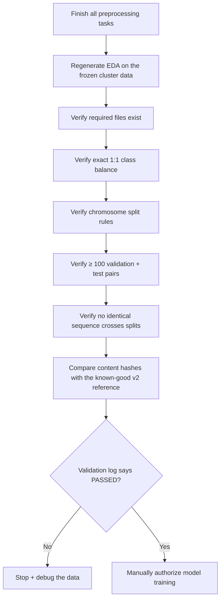

The validation script exits nonzero on any hard failure. I also tested the gate by intentionally corrupting a split and removing an expected ablation file; the gate correctly failed.

## 5.3 Reproducibility Hash

For the primary datasets, I compute a SHA-256 hash of all content columns except the intentionally changed split label. I compare the fresh Explorer output with hashes recorded from the known-good **v2** data. (Here `v2` is a prior validated build of this pipeline; `rbp-binding` is the corrected, from-scratch rebuild whose only intended data change from v2 is the multi-chromosome split — so identical content hashes are exactly what I expect.)

All 16 proteins reported `vs_v2 = match`, demonstrating that the fresh extraction reproduced the expected content.

---

# 6. Models

## 6.1 Model Families

| Model | Approximate scale | Adaptation strategy | Why I included it |
|---|---:|---|---|
| DeepBind-style CNN | ~7K parameters | Trained from scratch | Strong local-motif baseline |
| RNABERT | ~0.5M parameters | Full fine-tuning | Small general RNA language model |
| SpliceBERT | ~20M parameters | Full fine-tuning | Pre-mRNA specialist aligned with splicing-rich biology |
| RNA-FM | ~100M parameters | LoRA on query/value + trained head | Large generalist adapted parameter-efficiently |

## 6.2 Common Model Flow

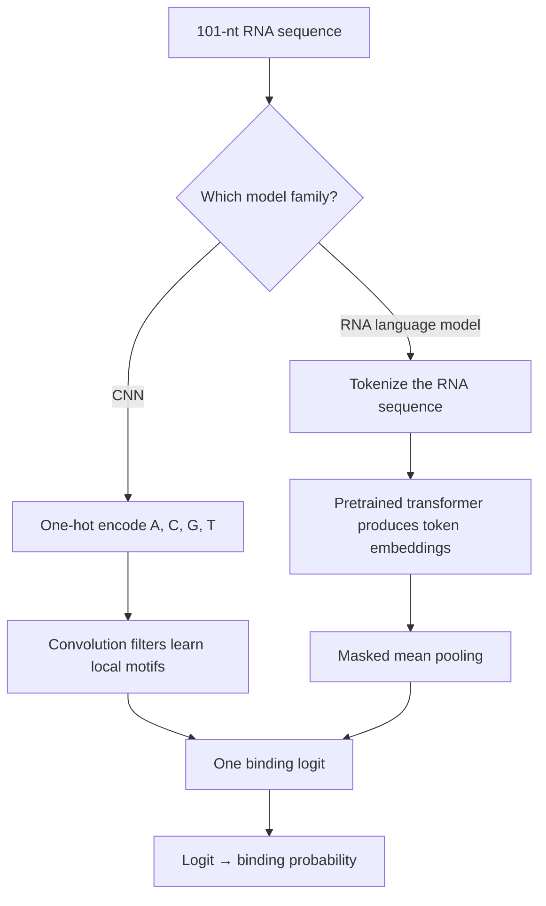

## 6.3 CNN Architecture

```text
(B, 4, 101)
  → Conv1d(4→16, kernel=12, same)
  → ReLU
  → MaxPool(4)
  → Conv1d(16→32, kernel=8, same)
  → ReLU
  → AdaptiveMaxPool(1)
  → Linear(32→64)
  → ReLU
  → Dropout
  → Linear(64→1)
```

The first convolutional filters function as learned motif detectors. The CNN is small enough that I train it on CPU and perform a grid search over learning rate and dropout.

## 6.4 RNA-FM with LoRA

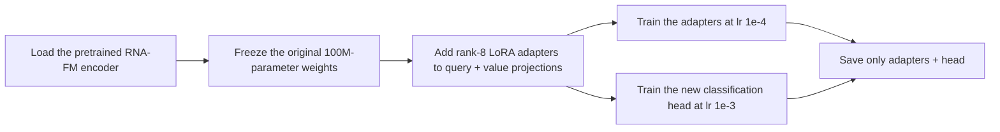

This gives the model task-specific flexibility while training less than 1% of the original parameter count.

## 6.5 Training Protocol

### CNN

- optimizer: AdamW;
- batch size: 64;
- maximum epochs: 40;
- early-stopping patience: 6;
- weight decay: `1e-4`;
- hyperparameter grid: learning rate `{1e-3, 5e-4}` × dropout `{0.5, 0.3}`;
- selection metric: validation AUROC.

### RNA language models

- optimizer: AdamW;
- batch size: 32;
- maximum epochs: 12;
- early-stopping patience: 4;
- weight decay: `1e-2`;
- learning rates: fully fine-tuned encoders (RNABERT, SpliceBERT) at `3e-5`, LoRA adapters (RNA-FM) at `1e-4`, all classification heads at `1e-3`;
- selection metric: validation AUROC;
- test set evaluated once after model selection.

I use seed `7` throughout the pipeline.

---

## 6.6 Evaluation Metrics

I report both **AUROC** and **AUPRC** for the binding task. AUROC measures how consistently a model ranks bound windows above matched negatives across thresholds. AUPRC emphasizes precision and recall on the positive class and remains informative when class prevalence changes.

I use validation AUROC for early stopping and hyperparameter selection. I evaluate the held-out test chromosomes only after selecting the final checkpoint.

---

# 7. Main Results

## 7.1 Binding Prediction

Mean test AUROC across 16 proteins:

| Rank | Model | Mean test AUROC |
|---:|---|---:|
| 1 | **SpliceBERT** | **0.893** |
| 2 | RNA-FM + LoRA | 0.878 |
| 3 | DeepBind-style CNN | 0.860 |
| 4 | RNABERT | 0.787 |

SpliceBERT achieved the best protein-level score for **13 of 16 proteins**. RNA-FM led for IGF2BP2, IGF2BP3, and PTBP1.

The result supports two conclusions:

1. a tiny CNN remains a strong baseline because much RBP-binding signal is local and motif-driven;
2. biological alignment of pretraining can matter more than raw model size, because the 20M-parameter SpliceBERT outperformed the 100M-parameter general RNA-FM.

RNABERT (~0.5M parameters) collapsed to near-chance on the Pumilio proteins (PUM1 0.529, PUM2 0.576), illustrating the motif-capacity limit of a very small model.

## 7.2 Splice-Confound Ablation

For each ablation run, I calculate:

```text
drop = primary_test_AUROC - splice_matched_test_AUROC
```

A large positive drop would indicate that the primary score depended heavily on splice-site proximity.

Observed result:

- every absolute drop was at most **0.046**;
- most changes were at most **0.02**;
- several splice-matched scores improved rather than declined;
- SpliceBERT on PUM1 achieved 0.854 with splice-matched negatives versus 0.840 on the primary set.

I therefore interpret the EDA splice-site enrichment as a real biological correlate, but not as the primary shortcut driving model performance.

## 7.3 ClinVar Variant-Effect Analysis

For every eligible ClinVar SNV at or near a real eCLIP binding site, I create reference and alternate windows and calculate:

```text
delta = max over shifts of |p(reference) - p(alternate)|
```

I use shifts `[-40, -20, 0, 20, 40]` so the model can evaluate the variant at several relative positions within the 101-nt window.

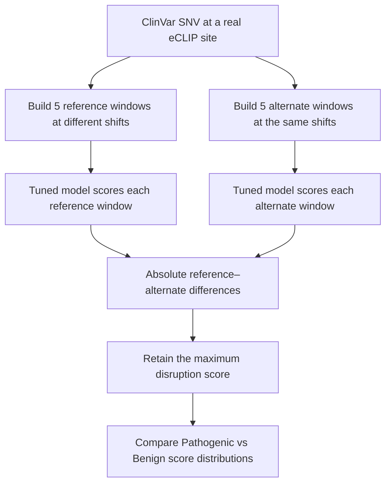

Results across **6,055** variants at real binding sites:

| Stratum | Pathogenic | Benign | CNN | RNA-FM + LoRA | RNABERT | **SpliceBERT** |
|---|---:|---:|---:|---:|---:|---:|
| All variants at sites | 2,163 | 3,892 | 0.557 | 0.564 | 0.542 | **0.740** |
| **Noncoding variants at sites** | 430 | 1,704 | 0.584 | 0.583 | 0.526 | **0.837** |
| Coding variants at sites | 691 | 2,170 | 0.530 | 0.545 | 0.546 | 0.576 |

I interpret this carefully:

- the noncoding result is strong for a model that received no clinical labels;
- the coding result is modest, as expected, because coding pathogenicity often acts by changing the encoded protein rather than RBP binding;
- this is a mechanistic research signal, not a diagnostic model.

## 7.4 Accuracy–Compute Trade-off

The GPU profiling output showed approximately:

| Model | Approximate training time per profiled run | Mean GPU utilization | Peak GPU memory |
|---|---:|---:|---:|
| RNA-FM + LoRA | ~398 s | ~88% | ~3.3 GB |
| SpliceBERT | ~109 s | ~58% | ~1.7 GB |

SpliceBERT was both the strongest average model and roughly **3.6× cheaper** in training time than RNA-FM in the profiled runs.

---

# 8. HPC and Slurm Engineering

I ran the production workflow on **Northeastern Explorer**, a shared HPC cluster managed by Slurm. This section explains not only the commands, but where every process and file resides.

## 8.1 Physical Roles: My Laptop, Login Node, and Compute Nodes

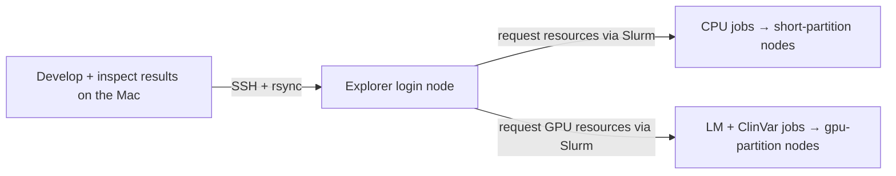

### How I use each location

- **My Mac:** I develop code, maintain documentation, and inspect downloaded results.
- **Login node:** I navigate files, submit jobs, monitor the queue, and inspect logs. I do not perform heavy training here.
- **Compute nodes:** These machines perform preprocessing, training, aggregation, and variant scoring.
- **Slurm:** Slurm chooses eligible compute nodes and enforces resource and QOS limits.

## 8.2 Shared Filesystem

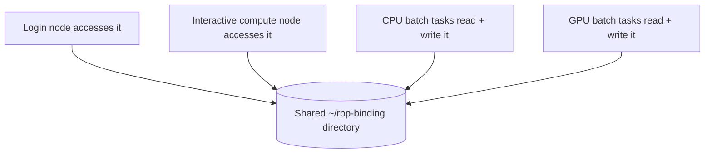

The CPUs and GPUs are not shared between nodes, but the filesystem is. This is why one node can create `data/processed/` and a completely different node can later train from those files.

## 8.3 Interactive Setup with `srun --pty`

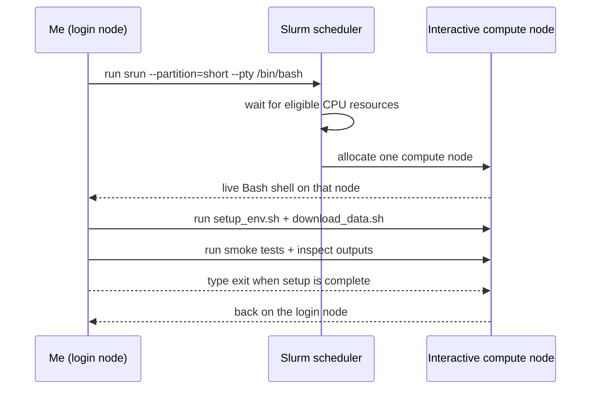

`bash` is a program, not a location. `srun --pty /bin/bash` asks Slurm to start an interactive Bash process on a compute node and connect my terminal to it.

## 8.4 Environment Creation Versus Activation

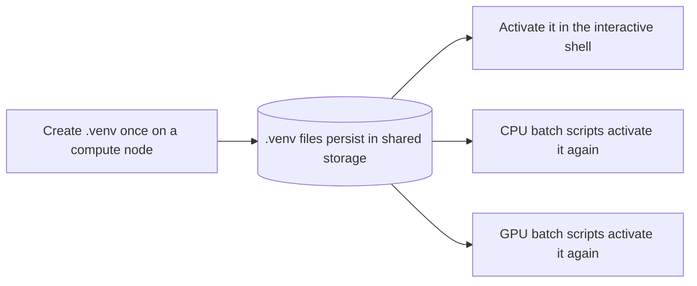

Creating `.venv` writes persistent files. Activating it only modifies the current shell. Every batch job starts in a fresh shell, so each `.sbatch` script must load the Python module, change into the project directory, and activate `.venv` independently.

## 8.5 Batch Submission with `sbatch`

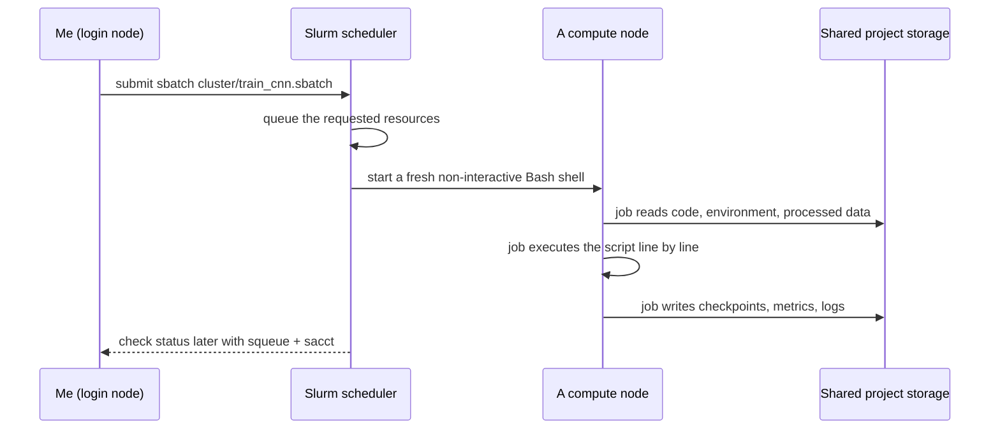

Unlike an interactive shell, an `sbatch` job continues after I disconnect from SSH because Slurm owns the process.

## 8.6 My Corrected Production Workflow

I use a deliberate human gate between data preparation and model training. I also submit ClinVar separately after aggregation to avoid exceeding the GPU QOS submission cap.

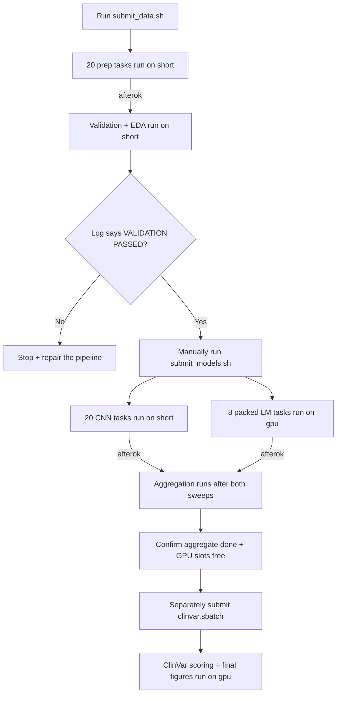

The separate ClinVar submission is intentional. The LM array already consumes all eight submitted GPU-job slots; a dependent ClinVar job submitted at the same time would count as a ninth job and violate `QOSMaxSubmitJobPerUserLimit`.

## 8.7 Job Arrays

I use arrays because each protein or manifest entry is an independent unit of work.

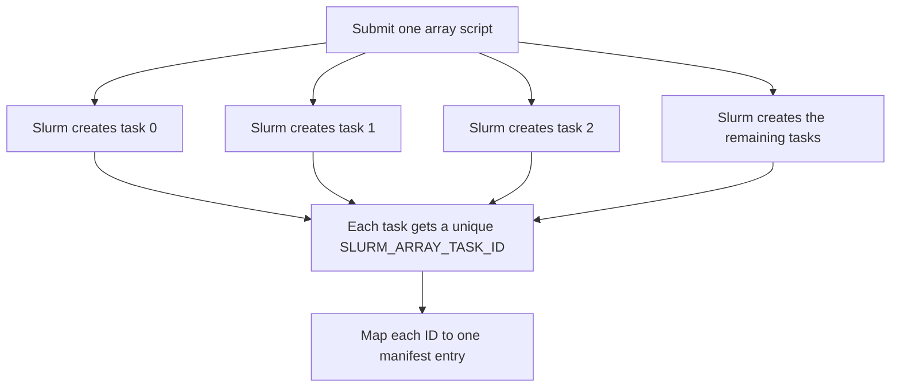

### CPU arrays

- `prep.sbatch`: `--array=0-19%8`
- `train_cnn.sbatch`: `--array=0-19%8`

Each array contains 20 tasks: 16 primary datasets plus 4 splice-matched ablation datasets. The `%8` throttle permits at most eight tasks to run simultaneously.

## 8.8 Manifest-Driven Task Mapping

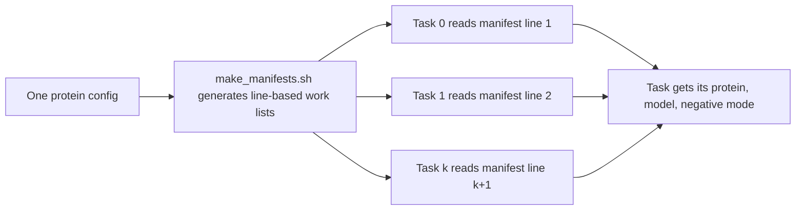

This prevents protein names and experiment combinations from being duplicated manually across scripts.

## 8.9 GPU QOS-Aware Packing

Explorer’s `gpu` QOS allows me to have at most **8 submitted GPU jobs**, **4 running GPU jobs**, and **4 GPUs allocated concurrently**.

I have 60 LM fine-tunes:

```text
(16 primary + 4 splice-matched) × 3 language models = 60
```

A 60-element GPU array would be rejected because every array element counts as a submitted job. I therefore pack the work into eight array tasks.

```mermaid
flowchart TD
    A["60 LM manifest lines"] --> B["Create 8 Slurm array tasks"]
    B --> C["Each task processes up to 8 manifest lines sequentially"]
    C --> D["8 tasks provide 64 total slots"]
    D --> E["Final 4 empty slots are skipped"]
    B --> F["Throttle the array with %4"]
    F --> G["At most 4 tasks use 4 V100 GPUs concurrently"]
    G --> H["Fits the 8-submitted / 4-running QOS exactly"]
```

This packing strategy is one of the main systems-engineering contributions of the project.

## 8.10 Dependency Graph

```mermaid
flowchart TD
    A["Prep array"] -->|"afterok"| B["Validation gate"]
    B -->|"manual approval"| C["CNN array"]
    B -->|"manual approval"| D["LM array"]
    C -->|"afterok"| E["Aggregate job"]
    D -->|"afterok"| E
    E -->|"submit after completion"| F["ClinVar GPU job"]
```

I use `afterok` rather than a simple time-based sequence. A downstream job starts only when every required upstream job exits successfully.

## 8.11 CPU and GPU Responsibilities

```mermaid
flowchart LR
    A["CPU resources"] --> B["Data preparation"]
    A --> C["Validation + EDA"]
    A --> D["CNN training"]
    A --> E["Metric aggregation"]
    F["GPU resources"] --> G["RNA-FM LoRA fine-tuning"]
    F --> H["RNABERT fine-tuning"]
    F --> I["SpliceBERT fine-tuning"]
    F --> J["ClinVar scoring with trained LMs"]
```

I reserve GPUs for work that benefits from accelerator throughput. The ~7K-parameter CNN trains efficiently on CPU.

## 8.12 Actual Explorer Resources

### Hardware used by the completed run

- **GPU:** NVIDIA Tesla V100-SXM2-32GB
- **GPU nodes used:** `d1017` and `d1019`
- **GPU-node capacity:** 4× V100 per node, 28 CPU cores (Intel Xeon Gold 6132 @ 2.60 GHz), ~191 GB RAM
- **`short` (CPU) nodes:** heterogeneous — most are 20+ cores / ~62 GB RAM (a few much larger; one sampled node was 28 cores / 256 GB). My CPU jobs requested ≤ 16 GB, so they fit any of them.
- **CUDA-compatible PyTorch build:** `cu118`

### Per-job resource requests

| Job | Partition | CPUs per task | Memory | GPU | Array/tasks | Typical elapsed time |
|---|---|---:|---:|---:|---|---:|
| `rbp-prep` | `short` | 4 | 16 GB | — | 20, throttled at 8 | 0.4–4.3 min/task |
| `rbp-validate` | `short` | 4 | 16 GB | — | 1 | ~20 sec |
| `rbp-cnn` | `short` | 4 | 8 GB | — | 20, throttled at 8 | 0.4–1.6 min/task |
| `rbp-lm` | `gpu` | 8 | 24 GB | 1× V100/task | 8, throttled at 4 | 8–34 min/task |
| `rbp-agg` | `short` | 2 | 8 GB | — | 1 | ~5 sec |
| `rbp-clinvar` | `gpu` | 8 | 24 GB | 1× V100 | 1 | ~5 min |

## 8.13 Moving Code and Results

```mermaid
flowchart TD
    A["Edit source + docs on the Mac"] -->|"rsync over SSH"| B[("Explorer project directory")]
    B --> C["Compute jobs generate data, models, metrics, logs"]
    C --> B
    B -->|"resumable rsync"| D["Pull results + model checkpoints back to the Mac"]
    D --> E["Audit the final artifact counts locally"]
```

I do not store the genome, virtual environment, or large regenerated outputs in Git. I use Git for source and documentation, and `rsync` for large or resumable transfers.

## 8.14 Monitoring and Accounting

```mermaid
flowchart LR
    A["Submit a job"] --> B["squeue --me for live state"]
    B --> C["scontrol show job for pending reasons + details"]
    C --> D["sacct after completion"]
    D --> E["Inspect ExitCode, elapsed, CPU, memory, assigned node"]
    E --> F["Inspect stdout/stderr logs before trusting results"]
```

Important commands:

```bash
squeue --me
scontrol show job <JOB_ID>
sacct -j <JOB_ID> -X --format=JobID,JobName,Partition,AllocCPUS,ReqMem,Elapsed,State,ExitCode,NodeList
scancel <JOB_ID>
tail -f logs/<LOG_FILE>.out
```

An empty `squeue` is not proof of success because completed and failed jobs both disappear. I use `sacct` and require `COMPLETED` with `ExitCode 0:0`.

---

# 9. Reproducible Execution

## 9.1 Local-to-Cluster Setup

From my Mac, I sync the source tree while excluding local environments and large data:

```bash
rsync -avz --progress \
  --exclude '.venv/' \
  --exclude 'data/' \
  ./rbp-binding/ \
  <USER>@login.explorer.northeastern.edu:~/rbp-binding/
```

## 9.2 Optional Fresh Start

When I need a completely clean rerun, I use the dry-run-first cleanup script **before** rebuilding the environment and downloading data:

```bash
cd ~/rbp-binding

# Preview every cancellation and deletion target
bash cluster/clean_start.sh

# Execute only after I verify the preview
bash cluster/clean_start.sh --force
```

The forced cleanup removes regenerable directories such as `.venv/`, `data/`, `models/`, `results/`, and `logs/`. I therefore run the environment and data setup again after a clean start.

## 9.3 Environment and Data Setup

I connect to Explorer and request an interactive CPU node:

```bash
ssh <USER>@login.explorer.northeastern.edu
cd ~/rbp-binding

srun \
  --partition=short \
  --cpus-per-task=8 \
  --mem=16G \
  --time=02:00:00 \
  --pty /bin/bash
```

Inside the allocated compute node:

```bash
cd ~/rbp-binding
bash cluster/setup_env.sh
bash cluster/download_data.sh
```

I then run the relevant smoke checks, confirm the files exist, and type:

```bash
exit
```

This returns me to the login node; it does not delete `.venv` or downloaded data because those files are on shared storage.

## 9.4 Production Run

### Phase A: data preparation and validation

```bash
bash cluster/submit_data.sh
squeue --me
```

After the jobs finish:

```bash
sacct -j <PREP_JOB_ID>,<VALIDATE_JOB_ID> -X \
  --format=JobID,JobName,State,ExitCode,Elapsed,NodeList

cat logs/validate_<VALIDATE_JOB_ID>.out
```

I proceed only when the log ends with:

```text
=== VALIDATION PASSED ===
```

### Phase B: model sweeps and aggregation

```bash
bash cluster/submit_models.sh
squeue --me
```

After CNN, LM, and aggregate jobs complete, I verify them with `sacct` and inspect the aggregate log and tables.

### Phase C: ClinVar scoring

I submit ClinVar separately after aggregate completion and after the packed LM array has released its GPU submission slots:

```bash
sbatch cluster/clinvar.sbatch
```

## 9.5 Final Artifact Audit

```bash
ls results/metrics/*.json | wc -l
ls models/cnn/*.pt | wc -l
ls models/lm/*.pt | wc -l
```

Expected counts:

| Artifact | Expected count |
|---|---:|
| Metric JSON files | 80 |
| CNN checkpoints | 20 |
| LM checkpoints | 60 |

---

# 10. Repository Structure

```text
rbp-binding/
├── config/
│   └── proteins.tsv
├── src/
│   ├── data_prep.py
│   ├── eda.py
│   ├── validate.py
│   ├── aggregate.py
│   ├── clinvar.py
│   ├── figures.py
│   ├── train_cnn.py
│   ├── train_lm.py
│   └── models/
│       └── cnn.py
├── notebooks/
│   └── 01_eda.ipynb
├── cluster/
│   ├── clean_start.sh
│   ├── setup_env.sh
│   ├── download_data.sh
│   ├── make_manifests.sh
│   ├── make_reference.py
│   ├── positives_ref.tsv
│   ├── prep.sbatch
│   ├── validate.sbatch
│   ├── train_cnn.sbatch
│   ├── train_lm.sbatch
│   ├── aggregate.sbatch
│   ├── clinvar.sbatch
│   ├── submit_data.sh
│   ├── submit_models.sh
│   └── README_CLUSTER.md
├── docs/
│   ├── RBP_BINDING_MASTERCLASS.md      # full science walkthrough
│   ├── CLUSTER_AND_OPS_MASTERCLASS.md  # full cluster & operations walkthrough
│   ├── cluster_config_summary.txt      # captured Slurm partition/QOS config
│   └── hw_probe.out                    # exact GPU/CPU probe
├── data/                  # generated and git-ignored
├── models/                # generated and git-ignored
├── results/               # generated and git-ignored
├── logs/                  # generated and git-ignored
├── eda/                   # generated EDA artifacts
├── requirements.txt
├── .gitignore
└── README.md              # this file — repo landing page
```

---

# 11. Generated Outputs

| Output | Purpose |
|---|---|
| `data/processed/<PROTEIN>/dataset.tsv` | Human-readable positive and negative sequence windows |
| `data/processed/<PROTEIN>/onehot.npz` | CNN-ready arrays |
| `*.splice_matched.*` | Confound-ablation datasets for four proteins |
| `results/metrics/*.json` | One record per model-training run |
| `results/model_comparison.tsv` | Protein × model test-AUROC table |
| `results/all_metrics.tsv` | Long-form metrics table |
| `results/ablation_splice.tsv` | Primary vs splice-matched comparisons |
| `results/clinvar_scores.tsv` | Per-variant disruption scores |
| `results/clinvar_summary.tsv` | Pathogenic/benign AUROC by stratum |
| `results/gpu_perf.tsv` | Time, utilization, and memory summaries |
| `results/figures/model_comparison.png` | Main binding-model comparison |
| `results/figures/gpu_dashboard.png` | GPU cost and utilization summary |
| `results/figures/acc_vs_compute.png` | Accuracy–compute trade-off |
| `results/figures/splice_ablation.png` | Confound-ablation visualization |
| `eda/figures/*.png` (11) | EDA stress-test figures on the frozen data |
| `eda/eda_summary.tsv` | Per-protein EDA summary table |

---

# 12. Engineering and Research Contributions

## What I Demonstrate Technically

- Integration of ENCODE, GENCODE, and ClinVar datasets
- Genomic coordinate-system normalization
- Strand-aware sequence extraction
- Two-pass GTF parsing and transcript-region annotation
- Indexed genomic interval lookup
- Controlled negative sampling with GC and distance constraints
- Whole-chromosome leakage prevention
- Reproducibility hashing and hard data-validation gates
- CNN and transformer training in PyTorch
- Parameter-efficient fine-tuning with LoRA
- Experimental ablation design
- Slurm job arrays, dependencies, manifests, QOS-aware packing, and accounting
- CPU/GPU resource separation and utilization measurement
- Reproducible artifact generation and local/cluster synchronization

## What I Demonstrate Scientifically

- I distinguish predictive performance from biological validity.
- I treat a discovered confound as a testable hypothesis rather than hiding it.
- I preserve the held-out test set for final evaluation.
- I report null and domain-limited results honestly.
- I avoid claiming that a mechanistic variant score is a clinical diagnostic.
- I compare model families under a shared dataset and tuning protocol.

---

# 13. Key Decisions and Trade-offs

| Decision | What I chose | Why |
|---|---|---|
| Model scope | Separate model per RBP | Each protein has a distinct binding preference |
| Input scope | Sequence only | Clear mechanistic and reproducible comparison |
| Window length | 101 nt | Captures motif plus local context at manageable LM cost |
| Negatives | Matched within transcript/region/GC/distance | Prevents trivial genomic-background shortcuts |
| Split | Whole chromosomes | Reduces overlap and locus leakage |
| Large-model tuning | LoRA for RNA-FM | Efficient adaptation of a ~100M model |
| Specialist model | Fully fine-tuned SpliceBERT | Tests whether domain-aligned pretraining beats size |
| Confound handling | Measure with an ablation | Quantifies rather than silently removes biological context |
| Cluster execution | Phase-gated Slurm pipeline | Prevents GPU spending on invalid data |
| LM scheduling | 8 packed tasks, 4 concurrent | Exactly fits Explorer’s 8/4 GPU QOS |

---

# 14. Limitations

I do not present this project as a complete model of post-transcriptional regulation.

- The primary models use sequence alone and do not directly incorporate RNA structure, expression, conservation, or cell-state information.
- eCLIP labels are cell-line-specific observations influenced by transcript expression and accessibility.
- The model comparisons are based on a single fixed seed; very small score differences should not be overinterpreted.
- ClinVar pathogenicity is complex, and the disruption score captures only one possible RNA-binding mechanism.
- The noncoding variant result applies to variants at real binding sites and should not be generalized to arbitrary variants.
- SpliceBERT’s strong ClinVar transfer result is mechanistically promising but is not a clinical predictor.
- Published baselines may use different proteins, negatives, splits, structures, or experimental assays and are not automatically apples-to-apples.

---

# 15. Troubleshooting Notes

## `torch.cuda.is_available()` is false during `setup_env.sh`

If I run setup on a `short` CPU node, this is expected because that node has no GPU. I verify CUDA separately inside a GPU allocation.

## RNA-FM reports `UNEXPECTED lm_head/ss_head` and `MISSING pooler.dense`

This is expected in my architecture. The pretrained checkpoint includes pretraining heads that I do not use, while the default pooler is not used because I perform masked mean pooling and train my own classification head. The encoder weights load normally.

## `srun --pty` appears frozen

The command may simply be waiting in the Slurm queue. It blocks the terminal until a node is allocated. My already submitted `sbatch` jobs are not affected.

## GPU submission fails with `QOSMaxSubmitJobPerUserLimit`

Every array element and held dependency counts toward the submitted-job cap. I keep the LM sweep at eight packed tasks and submit ClinVar only after the array and aggregate complete.

---

# 16. Tech Stack

- Python
- PyTorch
- NumPy / pandas
- scikit-learn
- pyfaidx
- Matplotlib
- Hugging Face Transformers
- MultiMolecule
- PEFT / LoRA
- Slurm
- Bash
- rsync / SSH
- ENCODE
- GENCODE
- ClinVar

Pinned language-model stack used in the Explorer environment:

```text
transformers==5.14.1
tokenizers==0.22.2
huggingface-hub==1.26.0
multimolecule==0.2.1
peft==0.20.0
PyTorch CUDA build: cu118
```

---

# 17. Portfolio Summary

I built an end-to-end RNA-binding research system that combines genomics data engineering, sequence modeling, pretrained RNA transformers, controlled confound testing, variant-effect analysis, and production-scale HPC orchestration.

The central result is not simply that SpliceBERT achieved the highest AUROC. The stronger story is that I:

1. discovered a plausible splice-site confound before training;
2. built a targeted negative-sampling ablation to test it;
3. showed that the model’s advantage persisted;
4. transferred the learned binding representation to a disease-variant task without disease-label training;
5. and executed the complete study through a validated, QOS-aware Slurm workflow.

---

# 18. Selected References and Data Resources

- ENCODE Project: https://www.encodeproject.org/
- GENCODE: https://www.gencodegenes.org/
- ClinVar: https://www.ncbi.nlm.nih.gov/clinvar/
- MultiMolecule: https://multimolecule.danling.org/
- Slurm documentation: https://slurm.schedmd.com/documentation.html
- Alipanahi et al. — DeepBind
- Van Nostrand et al. — ENCODE eCLIP
- Chen et al. — RNA-FM

---

## Final Takeaway

I designed RBP-Binding as a complete research system—not as a collection of disconnected model runs. The project begins with experimentally supported binding sites, builds a controlled and reproducible dataset, validates the data before spending GPU time, compares task-specific and pretrained architectures fairly, tests a biologically plausible confound, and evaluates whether the learned binding signal transfers to clinically interpreted variants.

My strongest result is a self-consistent research arc:

> **Splice-aware pretraining improves RBP-binding prediction, the advantage survives splice-distance matching, and the learned signal transfers most strongly to noncoding disease variants at real binding sites.**
